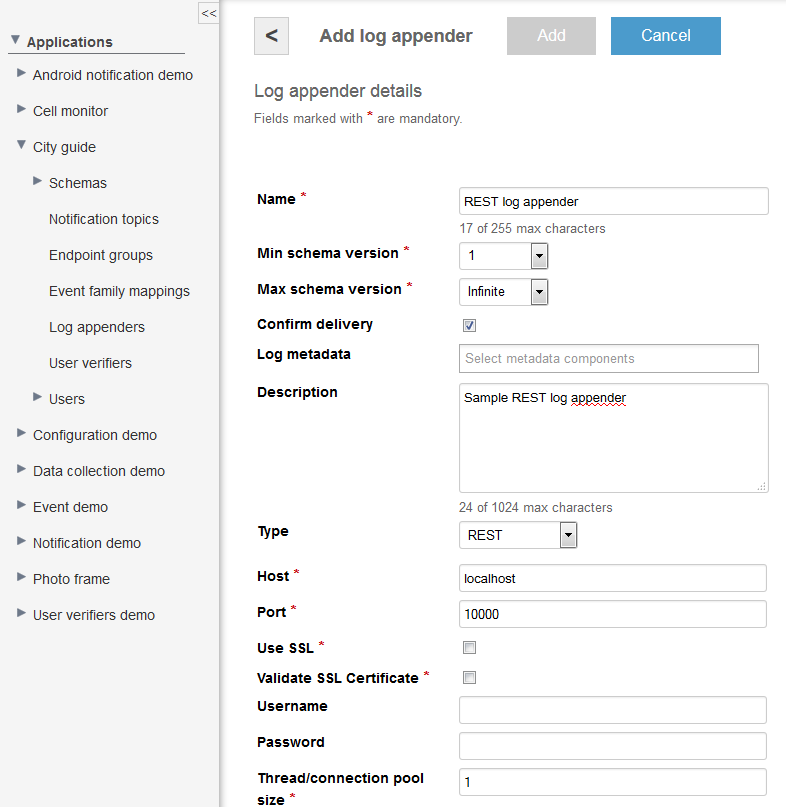
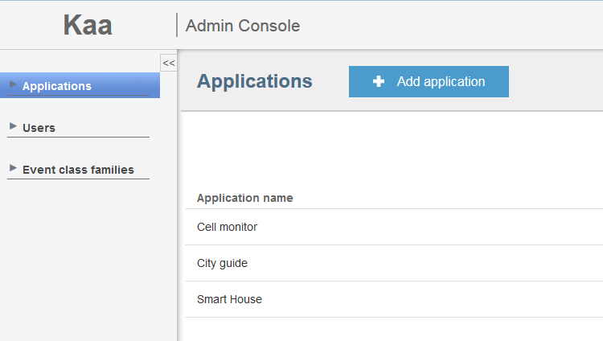




* TOC
{:toc}

The REST log appender is responsible for transferring logs from Operations service to your custom service.

# Creating REST log appender with Admin UI

The easiest way to create a Cassandra log appender for your application is by using Admin UI.

To create a log appender, do the following:

1. In the **Log appenders** window, click **Add log appender**.
2. Enter the log appender name and description, select the minimum and maximum supported log schema version, and select necessary log metadata fields.
3. Set the log appender type to _REST_.
4. Fill in other fields as required.
5. Click **Add** button. Log appender is ready and operational at this point.



# Creating REST log appender with Admin REST API

It is also possible to create a REST log appender instance by using
[Admin REST API]({{root_url}}Programming-guide/Server-REST-APIs/#!/Logging/editLogAppender).
The following example illustrates how to create the REST log appender via Admin REST API.

## Configuration

The Admin REST log appender configuration must match to
[this](https://github.com/kaaproject/kaa/blob/master/server/appenders/rest-appender/src/main/avro/rest-appender-config.avsc) Avro schema.

Parameters for defining REST log appender:

|parameter          |description                                                                                                                    |
|-------------------|-------------------------------------------------------------------------------------------------------------------------------|
|connectionPoolSize |number of threads that can simultaneously perform operations with your service                                                 |
|header             |boolean value that define whether to use a Kaa header                                                                          |
|host               |an IP address of your custom service that will receive logs                                                                    |
|method             |define a HTTP method that will be used for sending data (POST or PUT available)                                                |
|mimeType           |mime type the appender will use for sending data                                                                               |
|password           |password for user of service (if authentication required)                                                                      |
|path               |define the URI path that will be used to receive logs from REST appender                                                       |
|port               |port of service                                                                                                                |
|ssl                |boolean value that defines whether to use a SSL communication                                                                  |
|username           |name of user of your service (if authentication required)                                                                      |
|verifySslCert      |boolean value that defines whether to do verification of SSL Certificate (this might be not applicable in case of ssl = false) |

An example configuration that matches to previously introduced Avro schema is as below:

```json
{
    "host":"10.2.2.65",
    "port":9000,
    "ssl":false,
    "verifySslCert":false,
    "username":{
        "string":""
    },
    "password":{
        "string":""
    },
    "connectionPoolSize":1,
    "header":false,
    "path":"/encrypt",
    "method":"POST",
    "mimeType":"JSON"
}
```

Based on this configuration, you should be able to perform "POST" requests to the service URL http://10.2.2.65:9000/encrypt. Let's look at more definitive
example.

## Administration

The following Admin REST API call example illustrates how to create an instance of the REST log appender.

```bash
curl -v -S -u devuser:devuser123 -X POST -H 'Content-Type: application/json' -d @restLogAppender.json "http://localhost:8080/kaaAdmin/rest/api/logAppender" | python -mjson.tool
```

where file ```restLogAppender.json``` contains following data:

```json
{
    "pluginClassName":"org.kaaproject.kaa.server.appenders.rest.appender.RestLogAppender",
    "pluginTypeName":"REST",
    "applicationId":"5",
    "applicationToken":"82635305199158071549",
    "name":"Sample REST log appender",
    "description":"Sample REST log appender",
    "headerStructure":[
        "KEYHASH",
        "VERSION",
        "TIMESTAMP",
        "TOKEN",
        "LSVERSION"
    ],
    "maxLogSchemaVersion":2147483647,
    "minLogSchemaVersion":1,
    "tenantId":"1",
    "jsonConfiguration":"{\"host\":\"10.2.2.65\",\"port\":9000,\"ssl\":false,\"verifySslCert\":false,\"username\":null,\"password\":null,\"connectionPoolSize\":1,\"header\":false,\"path\":\"/encrypt\",\"method\":\"POST\",\"mimeType\":\"JSON\"}"
}
```

Example result:

```json
{
    "applicationId": "5",
    "applicationToken": "82635305199158071549",
    "confirmDelivery": true,
    "createdTime": 1467215901277,
    "createdUsername": "devuser",
    "description": "Sample REST log appender",
    "headerStructure": [
        "KEYHASH",
        "VERSION",
        "TIMESTAMP",
        "TOKEN",
        "LSVERSION"
    ],
    "id": "196608",
    "jsonConfiguration": "{\"host\":\"10.2.2.65\",\"port\":9000,\"ssl\":false,\"verifySslCert\":false,\"username\":null,\"password\":null,\"connectionPoolSize\":1,\"header\":false,\"path\":\"/encrypt\",\"method\":\"POST\",\"mimeType\":\"JSON\"}",
    "maxLogSchemaVersion": 2147483647,
    "minLogSchemaVersion": 1,
    "name": "Sample REST log appender",
    "pluginClassName": "org.kaaproject.kaa.server.appenders.rest.appender.RestLogAppender",
    "pluginTypeName": "REST",
    "tenantId": "1"
}

```

# Playing with REST log appender

1. Log in Admin UI as admin and create an application as described below:
2. Open the Applications window by clicking the corresponding link on the navigation panel.
 <br/>
3. Click **Add application** at the top of the window.
4.  Enter the title of your application, select Trustful credentials service type and then click **Add**.
    

    > **NOTE:**
    > If you open the Application details window of the newly created application (by clicking this application on either the Applications menu on the
    navigation panel or the Applications window), you will notice that the [Application Token]({{root_url}}Glossary) field has been filled in automatically. <br/>

5.  Log in as a tenant developer and create log schema in your previously created application: yourApp->Schemas->Log->Add schema
    
    Upload the following configuration schema:

    ```json
    {
        "name":"recordData",
        "type":[
            {
                "type":"record",
                "name":"Data",
                "namespace":"org.kaaproject.kaa.example.mobile.log",
                "fields":[
                    {
                        "name":"timestamp",
                        "type":[
                            "long",
                            "null"
                        ]
                    },
                    {
                        "name":"data",
                        "type":[
                            "bytes",
                            "null"
                        ]
                    },
                    {
                        "name":"endpointKeyHash",
                        "type":[
                            {
                                "type":"string",
                                "avro.java.string":"String"
                            },
                            "null"
                        ]
                    },
                    {
                        "name":"hashFunction",
                        "type":[
                            {
                                "type":"string",
                                "avro.java.string":"String"
                            },
                            "null"
                        ]
                    }
                ]
            },
            "null"
        ]
    }
    ```

6. Go to **Log appenders** menu and add **REST log appender** to your app using your custom configuration:
your app-> Log appenders -> Add log appender.

7. Write appropriate configuration for your appender and save results.
8. Then **generate SDK** appropriate to your platform.
9. Add downloaded sdk to your project directory.

10. The following code snippet illustrates handling POST request from Kaa server:

    ```
    @Controller
    @RequestMapping("/")
    public class  SampleController {

        final static Logger LOGGER = LoggerFactory.getLogger(SampleController.class);

        @ResponseBody
        @RequestMapping(method = RequestMethod.POST, value = "encrypt")
        public void encryptFile(@RequestBody String json) throws Exception {
            LOGGER.info(json);
        }
    }
    ```

11. The client code that sends logs to server might look like below:

    ```
    ...
    private KaaClient client;
    client = ... ;

    Data data = new Data(...);
    client.addLogRecord(data);
    ...
    ```

12. After sending logs from client, Kaa server will use previously created REST log appender which will send data to your custom service based on above code.
    You will see something like below:

    ```
    INFO 19797 --- [nio-9000-exec-1] o.k.k.e.controller.SampleController   : {"timestamp":{"long":1456165449702},"data":{"bytes":"hello world!\n"},"endpointKeyHash":{"string":"7xVRbtqcs6EySlgzqVr34SujpeY=\n"},"hashFunction":{"string":"SHA1"}}
    ```

If your output doesn't match above one, please follow our [troubleshooting guide]({{root_url}}Administration-guide/Troubleshooting).
