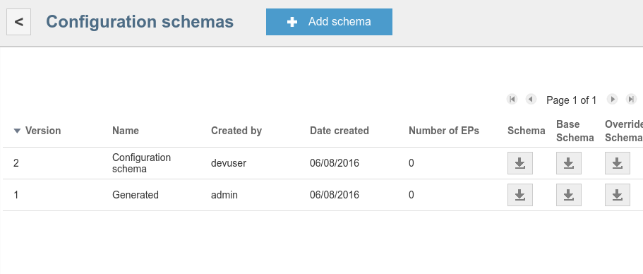
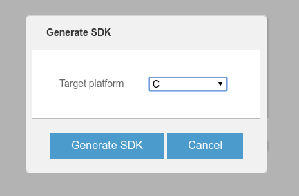
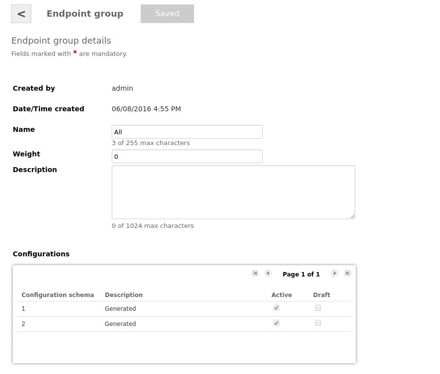


 /{{root_url[1]}}/{{root_url[2]}}/

- [Prerequisites](#prerequisites)
- [Application description](#application-description)
- [Adding application](#adding-application)
- [Creating schemas](#creating-schemas)
- [Log appenders setup](#log-appenders-setup)
- [Generating SDK](#generating-sdk)
- [Sample client application](#sample-client-application)
    - [Preparation](#preparation)
    - [Application code](#application-code)
    - [Retrieving collected data](#retrieving-collected-data)
    - [Changing sample period](#changing-sample-period)
- [Next steps](#next-steps)
    - [Profiling and grouping](#profiling-and-grouping)
    - [Using notifications](#using-notifications])
    - [Events](#events)
    - [Distibuting operation data](#distibuting-operation-data)
- [Troubleshooting](#troubleshooting)
- [Further reading](#further-reading)

# Prerequisites

To register a new application within a fresh Kaa server installation,
you need to create users with the [tenant administrator]({{root_url}}/Administration-guide/Tenants-and-applications-management/#tenant-admin) and [tenant developer]({{root_url}}/Administration-guide/Tenants-and-applications-management/#tenant-developer) roles.
The tenant administrator is responsible for creating new applications in Kaa,
and the tenant developer configures and generates SDKs for those applications.
We suggest that you use Kaa Sandbox, which has a tenant administrator and tenant
developer users already created.

# Application description

Application created trough this guide covers the basic case of collecting
temperature data from a sensor. Usually, simple sensors stream data at constant
rate, no matter what. However, rising demand of mobility and power efficiency dictates own
rules of game. It is not viable to keep sensors streaming all the time, especially
if a data is not required at this moment. That's a point where we can save power by
configuring sample period.

To satisfy application requirements two of main Kaa features are used:

- **Data Collection** feature that allows to send data from endpoints
to the Kaa server. In this example Data Collection is used to reliably transmit
temperature samples from sensor to the Kaa.

- **Configuration** feature that allows to broadcast configuration parameters
from the Kaa server to Kaa endpoints. In this guide Configuration is used
to pass a sample period of the temperature to endpoint.

# Adding application

To add an application, proceed as follows:

1. Open the [Kaa admin UI in your browser](http://127.0.0.1:8080) and log in
as a tenant administrator (user/password: admin/admin123).
1. Select **Applications** on the navigation panel on the left side and, in the
Applications window that opens, click **Add application**.
1. In the Add application window, enter the application name and then click **Add**.
For this guide we will use **Trustful** credential service and our application will be
named "My First Kaa Application"

    

After the application has been added, you may log out. We will not be using
the tenant administrator role in this guide anymore.

# Creating schemas

The application that you have created in the previous step already includes
the default versions of the profile, configuration, notification and log schemes
ready for use. However, in this sample application, we will use a custom data
collection and configuration schemas for demonstration purposes. Default value for
sampling period is set to 1 second.

To create and upload the schemas, proceed as follows:

1. Create the *data-schema.json* file on your PC with the following schema definition:

        {
            "type": "record",
            "name": "DataCollection",
            "namespace": "org.kaaproject.kaa.schema.example",
            "fields": [
                {
                    "name": "temperature",
                    "type": "int"
                }
            ]
        }
1. Create the *configuration-schema.json* file and add following schema:

        {
            "type": "record",
            "name": "Configuration",
            "namespace": "org.kaaproject.kaa.schema.example",
            "fields": [
                {
                    "name": "samplePeriod",
                    "type": "int",
                    "by_default": "1"
                }
            ]
        }
1. Open the admin UI in your browser and log in as
    a tenant developer (user/password: devuser/devuser123).
1. Open the relevant **Log schemas** window (**Applications =>
    My First Kaa Application => Schemas => Log**) and click **Add schema**.
1. In the **Add log schema** window, enter the name and description
    of the new data collection schema.

    
1. Scroll down and use the **Upload from file** function to find the previously
    created json file with the schema. Alternatively, you can use the
    [Schema Avro UI]({{root_url}}/Administration-guide/Tenants-and-applications-management/#avro-ui-forms).
    form to create the schema.
1. Click **Upload**.
1. Click **Add** at the top of the window.
1. Repeat uploading and adding for the configuration schema
    (*configuration-schema.json*) scheme:

    

As a result of these operations you will see configuration and data collections
schemes in the list:



In this screenshot, version 2.0 is log and configuraion schema version that
was just created. We will use this version for the SDK generation later.

# Log appenders setup

In order to use Data Collection feature it is required to setup **Log Appender**.
In this example we will use MongoDB log appender.
Refer to [Admin UI section describing how to setup it]({{root_url}}/Administration-guide/Tenants-and-applications-management/#mongodb-log-appender).

# Generating SDK

To generate an SDK for the new application, proceed as follows:

1. Select the **My First Kaa Application** application and click **Generate SDK**.

    
1. Click **Add SDK profile**.

    
1. In the **Add SDK profile** window, fill in the fields as shown in the following
screenshot  and then click **Add**.

    
1. Now the SDK is configured and ready to be generated. Click **Generate SDK** for
corresponding SDK profile. In the **Generate SDK** window select the target platform for
your SDK and click Generate SDK.

    

    

After the SDK is generated, you will be presented with a window asking you to save a
.jar file with the generated SDK (for Java) or an archive with the generated SDK (for C,
C++ or Objective-C). Specify the file name and location on your computer and then click
**Save**. The SDK is now downloaded to your computer.

Note that in this example we are generating the SDK based on the default profile and
notification schemas. These schemas are automatically populated during the creation of
the application.
If necessary, you can overwrite them using [Admin UI]({{root_url}}/Administration-guide/Tenants-and-applications-management/).

# Sample client application

Once you have downloaded the SDK, you can use it in your sample project. The following
code block illustrates a simple desktop application that will send virtual temperature
data from the Kaa endpoint with required configuration.

NOTE: After generating the C++/Objective-C SDKs, you need to build them before creating the application.

## Preparation

<ul class="nav nav-tabs">
  <li class="active"><a data-toggle="tab" href="#prep-c">C SDK</a></li>
  <li><a data-toggle="tab" href="#prep-java">Java SDK</a></li>
</ul>

<div class="tab-content">

<div id="prep-c" class="tab-pane fade in active" markdown="1" >

Before you start with C application code, CMake file must be filled.
Unpack C SDK to the `kaa` directory and create `CMakeLists.txt` file in the application dir.

```cmake
cmake_minimum_required(VERSION 2.8.8)
project(kaa-application C)

find_package(OpenSSL REQUIRED)

set(CMAKE_C_FLAGS "${CMAKE_C_FLAGS} -std=gnu99 -g -Wall -Wextra")

add_subdirectory(kaa)

add_executable(kaa-app main.c)
target_link_libraries(kaa-app kaac crypto)

```

Main source file will be almost empty for now.

```c
int main(void)
{

}
```

To validate that build system works as expected, create dummy `main.c` file and
trigger a build.

```
mkdir build
cd build
cmake ..
make
```

If all is done right, you will see demo application executable in your directory.

```
$ ls -l kaa-app
-rwxr-xr-x 1 user 53944 Jun 10 12:36 kaa-app
```

</div>

<div id="prep-java" class="tab-pane fade" markdown="1" >

Describe preparation steps before using Java SDK

</div>

</div>


## Application code

Now it is time to write application code that will send temperature data with the
configured sampling period.

<ul class="nav nav-tabs">
  <li class="active"><a data-toggle="tab" href="#app-c">C</a></li>
  <li><a data-toggle="tab" href="#app-java">Java</a></li>
</ul>

<div class="tab-content">
<div id="app-c" class="tab-pane fade in active" markdown="1" >

```c
#include <stdio.h>
#include <stdlib.h>
#include <stdint.h>
#include <time.h>

#include <kaa/kaa.h>
#include <kaa/platform/kaa_client.h>
#include <kaa/kaa_error.h>
#include <kaa/kaa_configuration_manager.h>
#include <kaa/kaa_logging.h>
#include <kaa/gen/kaa_logging_gen.h>
#include <kaa/platform/kaa_client.h>
#include <utilities/kaa_log.h>
#include <kaa/platform-impl/common/ext_log_upload_strategies.h>

static int32_t sample_period;
static time_t  last_sample_time;

extern kaa_error_t ext_unlimited_log_storage_create(void **log_storage_context_p, kaa_logger_t *logger);

/* Retrieves current temperature. */
static int32_t get_temperature_sample(void)
{
    /* For sake of example random data is used */
    return rand() % 10 + 25;
}

/* Periodically called by Kaa SDK. */
static void example_callback(void *context)
{
    time_t current_time = time(NULL);

    /* Respect sample period */
    if (difftime(current_time, last_sample_time) >= sample_period) {
        int32_t temperature = get_temperature_sample();

        printf("Sampled temperature: %i\n", temperature);
        last_sample_time = current_time;

        kaa_user_log_record_t *log_record = kaa_logging_data_collection_create();
        log_record->temperature = temperature;

        kaa_logging_add_record(kaa_client_get_context(context)->log_collector, log_record, NULL);
    }
}

/* Receives new configuration data. */
static kaa_error_t on_configuration_updated(void *context, const kaa_root_configuration_t *conf)
{
    (void) context;

    printf("Received configuration data. New sample period: %i seconds\n", conf->sample_period);
    sample_period = conf->sample_period;

    return KAA_ERR_NONE;
}

int main(void)
{
    /* Init random generator used to generate temperature */
    srand(time(NULL));

    /* Prepare Kaa client. */

    kaa_client_t *kaa_client = NULL;
    kaa_error_t error = kaa_client_create(&kaa_client, NULL);
    if (error) {
        return EXIT_FAILURE;
    }

    /* Configure notification manager. */

    kaa_configuration_root_receiver_t receiver = {
        .context = NULL,
        .on_configuration_updated = on_configuration_updated
    };

    error = kaa_configuration_manager_set_root_receiver(
        kaa_client_get_context(kaa_client)->configuration_manager,
        &receiver);

    if (error) {
        return EXIT_FAILURE;
    }

    /* Obtain default configuration, shipped within SDK. */

    const kaa_root_configuration_t *dflt = kaa_configuration_manager_get_configuration(
        kaa_client_get_context(kaa_client)->configuration_manager);

    printf("Default sample period: %i seconds\n", dflt->sample_period);

    /* Configure data collection. */

    void *log_storage_context         = NULL;
    void *log_upload_strategy_context = NULL;

    /* The internal memory log storage distributed with Kaa SDK. */
    error = ext_unlimited_log_storage_create(&log_storage_context,
        kaa_client_get_context(kaa_client)->logger);

    if (error) {
        return EXIT_FAILURE;
    }

    /* Create a strategy based on timeout. */
    error = ext_log_upload_strategy_create(
        kaa_client_get_context(kaa_client), &log_upload_strategy_context,
        KAA_LOG_UPLOAD_BY_TIMEOUT_STRATEGY);

    if (error) {
        return EXIT_FAILURE;
    }

    /* Strategy will upload logs every 5 seconds. */
    error = ext_log_upload_strategy_set_upload_timeout(log_upload_strategy_context, 5);

    if (error) {
        return EXIT_FAILURE;
    }

    /* Specify log bucket size constraints. */
    kaa_log_bucket_constraints_t bucket_sizes = {
         .max_bucket_size       = 32,   /* Bucket size in bytes. */
         .max_bucket_log_count  = 2,    /* Maximum log count in one bucket. */
    };

    /* Initialize the log storage and strategy (by default it is not set). */
    error = kaa_logging_init(kaa_client_get_context(kaa_client)->log_collector,
        log_storage_context, log_upload_strategy_context, &bucket_sizes);

    if (error) {
        return EXIT_FAILURE;
    }

    /* Start Kaa SDK's main loop. example_callback will be called 1 time per second. */

    error = kaa_client_start(kaa_client, example_callback, kaa_client, 1);

    /* Should get here only after Kaa stop. */

    kaa_client_destroy(kaa_client);

    if (error) {
        return EXIT_FAILURE;
    }

    return EXIT_SUCCESS;
}

```

</div>

<div id="app-java" class="tab-pane fade" markdown="1" >

```java
java java java
```

</div>

</div>

## Expected output

If to run application, following logs will be observed in console:

```
Default sample period: 1 seconds
Sampled temperature: 32
Sampled temperature: 26
Sampled temperature: 26
Sampled temperature: 31
Sampled temperature: 28
Sampled temperature: 28
```
Note that temperature value must be sampled 1 time per second as stated in the
configuration scheme.
Refer to the [Troubleshooting](#troubleshooting) section if something goes wrong.

## Retrieving collected data

Now it is time to stored temperature from the server.

1. Grab application token. It is a token that you can copy from the main window
    of the application the Administration UI.

    
1. Login to your machine running Kaa server (in case you are using sandbox
    default username and password are *kaa / kaa*).
1. Start MongoDB shell

        mongo kaa
1. Retrieve data using application token.

        db.logs_$your_application_token$.find()

## Changing sample period

It is time to tune sampling period on a server and see what happens on the
endpoint.

1. Make sure your client application is running and sampling temperature
1. Login to the **Admin UI** as a Tenant Developer and proceed to the **Endpoint Groups**
    section of your application.

    
1. Click on the endpoint group **All** and select configuration schema from
    **Configurations** section.

    
1. Click on the latest **Configuration schema** and activate **Draft** tab. Change
    sample period to, say, 5 seconds and hit **Save** button.

    
1. Now, activate a draft by clicking **Activate** button and see client output.

        Sampled temperature: 32
        Sampled temperature: 26
        Sampled temperature: 29
        Sampled temperature: 33
        Sampled temperature: 26
        Received configuration data. New sample period: 5
        Sampled temperature: 33
        Sampled temperature: 30
        Sampled temperature: 34
        Sampled temperature: 25

    You must notice that sampling period is  equal to the new
    sample period we set in **Admin UI**


# Next steps

To create a real-world IoT solution, you will most likely need to implement more
features into your application.

Kaa provides you with practically everything you might need.
The following overview will help you grasp the scope of Kaa capabilities
as well as get familiar with the essential documentation,
such as Programming guide and Administration UI guide.

## Profiling and grouping

During a new endpoint registration, Kaa creates an associated _endpoint profile_
for the endpoint. An endpoint profile is basically some meaningful information
about the endpoint which may be useful for specific applications.
Profiles may contain things like an OS version, amount of RAM, average battery life,
type of network connection, device operation mode – virtually anything.

An endpoint profile structure in Kaa is configured using a client-side endpoint
[LINK DOESN'T EXIST YET : profile schema](http://google.com). Based on the defined profile schema,
Kaa generates an object model operate against the client side and handles
data marshaling all the way to database. Whenever the client updates its profile information,
the endpoint SDK automatically sends these updates to the server as soon as the connection
becomes available.

For programming practice, see [collecting endpoint profiles]({{root_url}}/Programming-guide/Key-platform-features/Endpoint-profiles/).

The information collected in an endpoint’s profile can be used to
group endpoints into independently managed entities called _endpoint groups_.
On the back end, Kaa provides a [profile filtering language]({{root_url}}/Programming-guide/Key-platform-features/Endpoint-groups/)
for defining the criteria for group membership.

An endpoint can belong to any number of groups. Grouping endpoints can be used, for example,
to send targeted notifications or adjust software behavior by applying group-specific
configuration overrides.

For programming practice, see [using endpoint groups]({{root_url}}/Programming-guide/Key-platform-features/Endpoint-groups/).

## Using notifications

Kaa uses _notifications_ to distribute structured messages, posted within notification topics,
from the server to endpoints.
A notification structure is defined by a corresponding notification schema.

Endpoints are subscribed to notification topics, which can be either mandatory or optional. Access to notification topics is automatically granted according to the endpoint’s group
membership. Notifications can be sent either to every endpoint subscribed to a topic
or to an individual endpoint.

Notifications can be assigned expiration timestamps to prevent their delivery after a certain period of time.

For programming practice, [see using notifications]({{root_url}}/Programming-guide/Key-platform-features/Notifications/).


## Events

Kaa allows for delivery of _events_, which are structured messages, across endpoints.
When endpoints register with the Kaa server, they communicate which event types
they are able to generate and receive. Kaa allows endpoints to send events either
to virtual “chat rooms” or to individual endpoints.

Events can even be delivered across applications registered with Kaa – making it possible to quickly integrate and enable interoperability between endpoints running different applications

Some examples are: a mobile application that controls house lighting,
a car’s GPS that communicates with the home security system, a set of integrated
audio systems from different vendors that deliver a smooth playback experience as you walk
from one room to another.

Kaa events are implemented in a generic, abstract way, using non-proprietary schema
definitions that ensure identical message structures. The schema provides independence
from any specific functionality implementation details.

For programming practice, see [messaging across endpoints]({{root_url}}/Programming-guide/Key-platform-features/Events/).

## Distributing operational data

Kaa allows you to perform operational data updates, such as configuration data updates,
from the Kaa server to endpoints.
This feature can be used for centralized configuration management, content distribution, etc.
Since Kaa works with structured data and constraint types, it guarantees data integrity.

The Kaa server monitors the database for changes and distributes updates to endpoints
in the incremental form, thus ensuring efficient bandwidth use.
The endpoint SDK performs data merging and persistence, as well as notifies the client code
about the specific changes made to the data.
As a result, the client application knows exactly where in the data structure the changes
occurred and can be programmed to react accordingly.

Based on the endpoint’s group membership, it is possible to control what data
is available to the endpoint. This is achieved by applying group-specific data overrides,
which make it possible to adjust the behavior of the client application based on operational
conditions or usage patterns, fine-tune the algorithms according to feedback,
implement gradual feature roll-out, A/B testing, etc.

For programming practice, see [LINK DOESN'T EXIST YET : distributing data to endpoints](http://docs.kaaproject.org/display/KAA/Distributing+data+to+endpoints)

# Troubleshooting

To Be Defined.

# Further reading

Use the following guides and references to make the most of Kaa.

 - [Key features]({{root_url}}/Programming-guide/Key-platform-features/)

    Use this reference to learn about features and capabilities of Kaa (Endpoint profiling,
    Events, Notifications, Logging, and other features).

 - [Using endpoint SDKs]({{root_url}}/Programming-guide/Using-Kaa-endpoint-SDKs/)

    Use this guide to create advanced applications with Kaa using SDKs.

 - [Installation guide]({{root_url}}/Administration-guide/)

    Use this guide to install and configure Kaa either on a single Linux node or in a cluster environment.

 - [Contribute to Kaa]({{root_url}}/Customization-guide/How-to-contribute/)

    Use this guide to learn how to contribute to Kaa project and which code/documentation style conventions we adhere to.