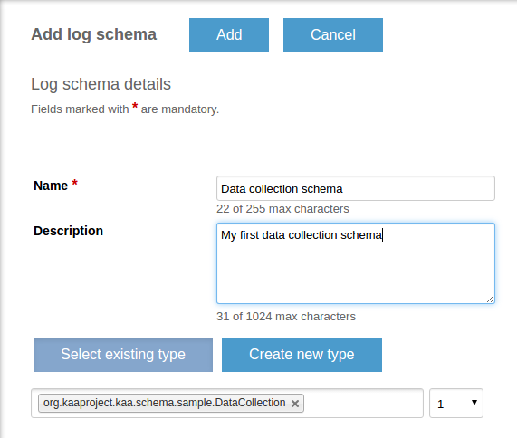
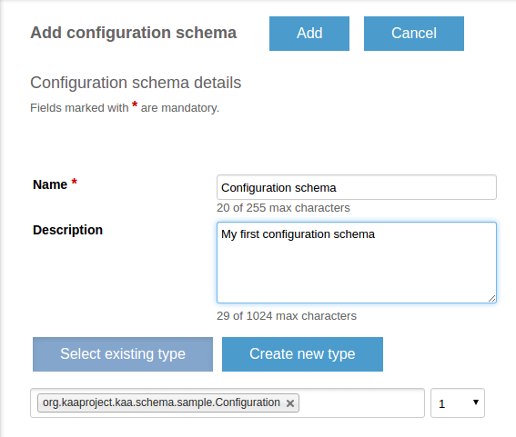
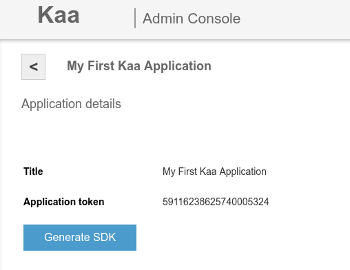
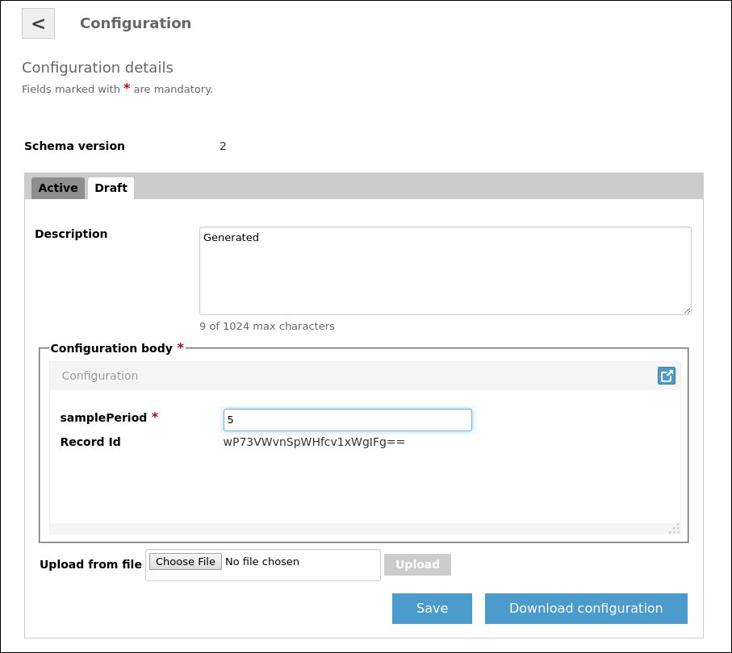



* TOC
{:toc}

This section discusses the basics of creating Kaa-based applications using the [Kaa Sandbox]({{root_url}}Glossary/#kaa-sandbox).
Main principles of the Kaa platform operation are exemplified by a practical case of collecting data from sensor devices.

To learn more about Kaa features, see [Further reading](#further-reading).

## Prerequisites

To register a new [application]({{root_url}}Glossary/#kaa-application) within a fresh [Kaa server]({{root_url}}Glossary/#kaa-server) installation, you need to create users with the [tenant administrator]({{root_url}}Administration-guide/Tenants-and-applications-management/#tenant-admin) and [tenant developer]({{root_url}}Administration-guide/Tenants-and-applications-management/#tenant-developer) roles.
Tenant administrator creates new applications in Kaa.
Tenant developer configures and generates SDKs for those applications.
It is recommended that you use the Kaa Sandbox that already includes a tenant administrator and a tenant developer.

To learn how to install the Kaa Sandbox, see [Getting started]({{root_url}}Getting-started/).

## Application description

To demonstrate the process of creating a Kaa-based application, let's create an application where sensor devices transmit temperature data to the server.
To make your application more efficient, you can configure it so that the data transmissions occur at various sampling periods set by the user.

To achieve this, two Kaa features will be used:

- **Data collection** feature allows sending data from [endpoints]({{root_url}}Glossary/#endpoint-ep) to the Kaa server.
In this example, the Data collection feature will be used to transmit temperature values at a configured sample period.

- **Configuration** feature allows broadcasting configuration parameters from the Kaa server to Kaa endpoints.
In this example, the Configuration feature will be used to send the sampling period values from Kaa server to the temperature sensors.

## Add application

To add an application:

1. On the Sandbox main page, click **Administration UI** and log in as a [tenant administrator]({{root_url}}Glossary/#tenant-administrator) using default **admin** username and **admin123** password.

2. On the **Administration UI** page, click **Add application**.

3. On the **Application details** page, enter a title for your new application, select a credentials service and click **Add**.

	

## Create schemas

The application you just created already includes default versions of the profile, configuration, notification, and log schemas ready for use.
However, you can create custom data collection and configuration schemas.

To create and upload custom schemas:

1. Create a `data-schema.json` file containing the following schema definition.

		{
			"type": "record",
			"name": "DataCollection",
			"namespace": "org.kaaproject.kaa.schema.sample",
			"fields": [
				{
					"name": "temperature",
					"type": "int"
				}
			]
		}
		
2. Create a `configuration-schema.json` file containing the following schema definition.
The `by_default` parameter defines the default sampling period value which is set to **1** in this example case.

		{
			"type": "record",
			"name": "Configuration",
			"namespace": "org.kaaproject.kaa.schema.sample",
			"fields": [
				{
					"name": "samplePeriod",
					"type": "int",
					"by_default": 1
				}
			]
		}
		
3. Use the **Upload from file** section to [create CT schemas]({{root_url}}Programming-guide/Key-platform-features/Common-Type-Library/#create-a-new-ct) of Application scope from the `data-schema.json` and `configuration-schema.json` files.

4. On the Sandbox main page, click **Administration UI** and log in as a [tenant developer]({{root_url}}Glossary/#tenant-developer) using default **devuser** username and **devuser123** password.

5. Click the **Applications** arrow to unfold the list and click the arrow of the application you created in [Add application](#add-application), then click **Schemas** > **Log** and click the **Add schema** button.

6. On the **Add log schema** page, enter a name and description of the new data collection schema and select the CT created from the `data-schema.json` file.

	

7. Click the **Add** button at the top of the page.

>**NOTE:** Alternatively, you can use the [Avro UI form]({{root_url}}Glossary/#avro-ui-form) to create the schema.
{: .note}

To create a configuration schema repeat the same procedure using the `configuration-schema.json` file.



As a result, your configuration and data collection schemas will appear in the list.
Note that every time you add a new schema, Kaa assigns a new version number to it.
In this example, the log and configuration schemas are version 2.
Your version numbers may differ from this example.


The version number will be required later to generate an SDK.

## Set up log appender

To use the data collection feature, you need to set up a **Log appender**.
In this example, the MongoDB log appender is used.
For more information, see [MongoDB log appender]({{root_url}}Programming-guide/Key-platform-features/Data-collection/MongoDB-log-appender).

## Generate SDK

To generate an SDK for your new application:

1. Select your new application in the **Applications** list and click the **Generate SDK** button.

	

2. Click **Add SDK profile**.

	

3. On the **Add SDK profile** page, fill in the fields as below.

	

	>**NOTE:** Version numbers in the screenshot correspond to the version numbers obtained in [Create schemas](#create-schemas).
	>Your version numbers may be different from the example.
	>You should use the version numbers of your own configuration and data collection schemas.
	{: .note}

	When you filled in the fields, click **Add**.

4. Your new SDK profile will appear in the **SDK profiles** list of your new application.
Click the corresponding **Generate SDK** button.
In the **Generate SDK** window, select the target platform for your SDK and click **Generate SDK**.

	
	

	The system will ask you to download the SDK archive file.
	Save the file in a preferred location.

>**NOTE:** In this example, the SDK is generated using the default profile and notification schemas.
>These schemas are automatically populated after the application is created.
>If necessary, you can overwrite them using the Administration UI.
{: .note}

## Sample client application

Once you downloaded the SDK, you can use it in your sample project.
The following section will illustrate a simple desktop application that sends temperature data from Kaa endpoint to Kaa server at a sampling period set by the user.

### Preparation

<ul class="nav nav-tabs">
  <li class="active"><a data-toggle="tab" href="#prep-c">C SDK</a></li>
  <li><a data-toggle="tab" href="#prep-cpp">C++ SDK</a></li>
  <li><a data-toggle="tab" href="#prep-java">Java SDK</a></li>
  <li><a data-toggle="tab" href="#prep-obj-c">Objective-C</a></li>
</ul>

<div class="tab-content">

<div id="prep-c" class="tab-pane fade in active" markdown="1" >

Before using the C application code, be sure to complete the following steps:

1. Install CMake.
To do this, run the following commands in the terminal.

		sudo apt-get install cmake
		
2. Create a directory named `kaa` and unpack the C SDK archive into it.

3. In the application directory, create a `CMakeLists.txt` file with the following contents.

   ```bash
   cmake_minimum_required(VERSION 2.8.12)
   project(kaa-application C)

   set(CMAKE_C_FLAGS "${CMAKE_C_FLAGS} -std=gnu99 -g -Wall -Wextra")

   add_subdirectory(kaa)

   add_executable(kaa-app main.c)

   target_link_libraries(kaa-app kaac)
   ```

4. Create a `main.c` source file containing empty main routine (for now).

   ```c
   int main(void)
   {

   }
   ```

5. To validate your build, run the following commands.

   ```bash
   mkdir build
   cd build
   cmake -DBUILD_TESTING=OFF ..
   make
   ```

6. Check that the demo application executable file is present in the build directory.

   ```bash
   $ ls -l kaa-app
   -rwxr-xr-x 1 user 53944 Jun 10 12:36 kaa-app
   ```

Your application directory structure should look like this:

```
./my-kaa-application/
	CMakeLists.txt
	kaa/
		<unpacked SDK should be placed here>
	src/
		kaa-application.c
	<other sources related to the Kaa application>
```

</div>

<div id="prep-cpp" class="tab-pane fade" markdown="1" >

Before using the C++ application code, be sure to complete the following steps:

1. Install the required libraries:  [CMake, Boost, AvroC++, Botan]({{root_url}}Programming-guide/Using-Kaa-endpoint-SDKs/C++/SDK-Linux/#installing-prerequisites).

2. Create a `kaa` directory and unpack the C++ SDK into it.

3. In the application directory, create a `CMakeLists.txt` file with the following contents.

   ```bash
   cmake_minimum_required(VERSION 2.8.12)
   project(Cpp-SDK-your-first-Kaa-application CXX)
   
   add_subdirectory(kaa)
   add_executable(kaa-app main.cpp)
   target_link_libraries(kaa-app kaacpp)
   ```

4. Create a `main.cpp` source file with empty main routine (for now).

   ```cpp
   int main()
   {
       return 0;
   }
   ```

5. Validate that build system works as expected by triggering a build.

   ```bash
   mkdir build
   cd build
   cmake ..
   make
   ```

6. Check that demo application executable is present in the build directory.

   ```bash
   $ ls -l kaa-app
   -rwxr-xr-x 1 user 53944 Jun 10 12:36 kaa-app
   ```

Your application directory structure should look like this:

```
./my-kaa-application/
	CMakeLists.txt
	kaa/
		<unpacked SDK should be placed here>
	src/
		kaa-application.cpp
	<other sources related to the Kaa application>
```

</div>

<div id="prep-java" class="tab-pane fade" markdown="1" >

Before using the Java application code, be sure to complete the following steps:

1. Install [Oracle JDK 8](http://www.oracle.com/technetwork/java/javase/downloads/index.html) for your OS.

2. Create a `demo_app` directory.

3. Use the Administration UI to [generate Java SDK]({{root_url}}Programming-guide/Your-first-Kaa-application/#generate-sdk) into the `demo_app` directory.

</div>

<div id="prep-obj-c" class="tab-pane fade" markdown="1" >

Before using the Objective-C application code, be sure to complete the following steps:

1. Install CocoaPods.

2. Extract Kaa SDK, open a terminal from the extraction directory, and run the following command.

   ```bash
   sh build.sh compile
   ```

3. Go to xCode and choose a template of the iOS Single View Application.
Name it "My First Kaa Application", choose Objective-C language and leave all other fields unchanged.

4. Link the SDK to your project as described in [Objective-C SDK]({{root_url}}Programming-guide/Using-Kaa-endpoint-SDKs/Objective-C/).

5. Make sure that your application builds successfully.

6. Replace code in the `ViewController.m` file with the code from the [Application code](#application-code) section.

</div>

</div>


### Application code

Click the appropriate tab to see a code example for the application that sends temperature data at a configured sampling period.

<ul class="nav nav-tabs">
  <li class="active"><a data-toggle="tab" href="#app-c">C SDK</a></li>
  <li><a data-toggle="tab" href="#app-cpp">C++ SDK</a></li>
  <li><a data-toggle="tab" href="#app-java">Java SDK</a></li>
  <li><a data-toggle="tab" href="#app-obj-c">Objective-C</a></li>
</ul>

<div class="tab-content">

<div id="app-c" class="tab-pane fade in active" markdown="1" >

```c
#include <stdio.h>
#include <stdlib.h>
#include <stdint.h>
#include <time.h>
#include <kaa.h>
#include <platform/kaa_client.h>
#include <kaa_error.h>
#include <kaa_configuration_manager.h>
#include <kaa_logging.h>
#include <gen/kaa_logging_gen.h>
#include <platform/kaa_client.h>
#include <utilities/kaa_log.h>
#include <platform-impl/common/ext_log_upload_strategies.h>

static int32_t sample_period;
static time_t  last_sample_time;

extern kaa_error_t ext_unlimited_log_storage_create(void **log_storage_context_p, kaa_logger_t *logger);

/* Retrieves current temperature. */
static int32_t get_temperature_sample(void)
{
    /* For the sake of example, random data is used */
    return rand() % 10 + 25;
}

/* Periodically called by Kaa SDK. */
static void example_callback(void *context)
{
    time_t current_time = time(NULL);

    /* Respect sample period */
    if (difftime(current_time, last_sample_time) >= sample_period) {
        int32_t temperature = get_temperature_sample();

        printf("Sampled temperature: %i\n", temperature);
        last_sample_time = current_time;

        kaa_user_log_record_t *log_record = kaa_logging_data_collection_create();
        log_record->temperature = temperature;

        kaa_logging_add_record(kaa_client_get_context(context)->log_collector, log_record, NULL);
    }
}

/* Receives new configuration data. */
static kaa_error_t on_configuration_updated(void *context, const kaa_root_configuration_t *conf)
{
    (void) context;

    printf("Received configuration data. New sample period: %i seconds\n", conf->sample_period);
    sample_period = conf->sample_period;

    return KAA_ERR_NONE;
}

int main(void)
{
    /* Init random generator used to generate temperature */
    srand(time(NULL));

    /* Prepare Kaa client. */
    kaa_client_t *kaa_client = NULL;
    kaa_error_t error = kaa_client_create(&kaa_client, NULL);
    if (error) {
        return EXIT_FAILURE;
    }

    /* Configure notification manager. */
    kaa_configuration_root_receiver_t receiver = {
        .context = NULL,
        .on_configuration_updated = on_configuration_updated
    };

    error = kaa_configuration_manager_set_root_receiver(
        kaa_client_get_context(kaa_client)->configuration_manager,
        &receiver);

    if (error) {
        return EXIT_FAILURE;
    }

    /* Obtain default configuration shipped within SDK. */
    const kaa_root_configuration_t *dflt = kaa_configuration_manager_get_configuration(
        kaa_client_get_context(kaa_client)->configuration_manager);

    printf("Default sample period: %i seconds\n", dflt->sample_period);

    sample_period = dflt->sample_period;
    
    /* Configure data collection. */
    void *log_storage_context         = NULL;
    void *log_upload_strategy_context = NULL;

    /* The internal memory log storage distributed with Kaa SDK. */
    error = ext_unlimited_log_storage_create(&log_storage_context,
        kaa_client_get_context(kaa_client)->logger);

    if (error) {
        return EXIT_FAILURE;
    }

    /* Create a strategy based on timeout. */
    error = ext_log_upload_strategy_create(
        kaa_client_get_context(kaa_client), &log_upload_strategy_context,
        KAA_LOG_UPLOAD_BY_TIMEOUT_STRATEGY);

    if (error) {
        return EXIT_FAILURE;
    }

    /* Strategy will upload logs every 5 seconds. */
    error = ext_log_upload_strategy_set_upload_timeout(log_upload_strategy_context, 5);

    if (error) {
        return EXIT_FAILURE;
    }

    /* Specify log bucket size constraints. */
    kaa_log_bucket_constraints_t bucket_sizes = {
         .max_bucket_size       = 32,   /* Bucket size in bytes. */
         .max_bucket_log_count  = 2,    /* Maximum log count in one bucket. */
    };

    /* Initialize the log storage and strategy (by default, they are not set). */
    error = kaa_logging_init(kaa_client_get_context(kaa_client)->log_collector,
        log_storage_context, log_upload_strategy_context, &bucket_sizes);

    if (error) {
        return EXIT_FAILURE;
    }
    

    /* Start Kaa SDK's main loop. example_callback is called once per second. */
    error = kaa_client_start(kaa_client, example_callback, kaa_client, 1);

    /* Should get here only after Kaa stops. */
    kaa_client_destroy(kaa_client);
    
    if (error) {
        return EXIT_FAILURE;
    }

    return EXIT_SUCCESS;
}
```
>**NOTE:** Use the links to the [code]({{root_url}}Programming-guide/Your-first-Kaa-application/attach/demo-c/kaa_demo.c) and a [CMake]({{root_url}}/Programming-guide/Your-first-Kaa-application/attach/demo-c/CMakeLists.txt) files of the example.
{:.note}

</div>

<div id="app-cpp" class="tab-pane fade" markdown="1" >

```c++
#include <boost/asio.hpp>
#include <kaa/Kaa.hpp>
#include <kaa/IKaaClient.hpp>
#include <kaa/configuration/manager/IConfigurationReceiver.hpp>
#include <kaa/configuration/storage/FileConfigurationStorage.hpp>
#include <kaa/log/strategies/RecordCountLogUploadStrategy.hpp>
#include <memory>
#include <string>
#include <cstdint>

class ConfigurationCollection : public kaa::IConfigurationReceiver {
public:
    ConfigurationCollection()
        : kaaClient_(kaa::Kaa::newClient())
        , samplePeriod_(0)
        , interval_(samplePeriod_)
        , timer_(service_, interval_) 
    {
        // Set a custom strategy for uploading logs.
        kaaClient_->setLogUploadStrategy(
            std::make_shared<kaa::RecordCountLogUploadStrategy>(1, kaaClient_->getKaaClientContext()));
        // Set up a configuration subsystem.
        kaa::IConfigurationStoragePtr storage(
            std::make_shared<kaa::FileConfigurationStorage>(std::string(savedConfig_)));
        kaaClient_->setConfigurationStorage(storage);
        kaaClient_->addConfigurationListener(*this);
        auto handlerUpdate = [this](const boost::system::error_code& err) 
        {
            this->update();
        };
        timer_.async_wait(handlerUpdate);
    }
    
    ~ConfigurationCollection() 
    {
        // Stop the Kaa endpoint.
        kaaClient_->stop();
        std::cout << "Simple client demo stopped" << std::endl;
    }
    
    void run() 
    {
        // Run the Kaa endpoint.
        kaaClient_->start();
        // Read default sample period
        samplePeriod_ = kaaClient_->getConfiguration().samplePeriod;
        std::cout << "Default sample period: " << samplePeriod_<< std::endl;
        // Default sample period
        timer_.expires_from_now(boost::posix_time::seconds(samplePeriod_));
        service_.run();
    }
    
private:
    static constexpr auto savedConfig_ = "saved_config.cfg";
    std::shared_ptr<kaa::IKaaClient> kaaClient_;
    int32_t samplePeriod_;
    boost::asio::io_service service_;
    boost::posix_time::seconds interval_;
    boost::asio::deadline_timer timer_;
    
    int32_t getTemperature() 
    {
        // For sake of example random data is used
        return rand() % 10 + 25;
    }
    
    void update() 
    {
        kaa::KaaUserLogRecord logRecord;
        logRecord.temperature = getTemperature();
        // Send value of temperature
        kaaClient_->addLogRecord(logRecord);
        // Show log
        std::cout << "Sampled temperature: " << logRecord.temperature << std::endl;
        // Set a new  period of the send data
        timer_.expires_at(timer_.expires_at() + boost::posix_time::seconds(samplePeriod_));
        // Posts the timer event
        auto handlerUpdate = [this](const boost::system::error_code& err) 
        {
            this->update();
        };
        timer_.async_wait(handlerUpdate);
    }
    
    void updateConfiguration(const kaa::KaaRootConfiguration &configuration) 
    {
        std::cout << "Received configuration data. New sample period: "
            << configuration.samplePeriod << " seconds" << std::endl;
        samplePeriod_ = configuration.samplePeriod;
    }
    
    void onConfigurationUpdated(const kaa::KaaRootConfiguration &configuration) 
    {
        updateConfiguration(configuration);
    }
};

int main() 
{
    ConfigurationCollection configurationCollection;
    
    try {
        // It does control of the transmit and receive data
        configurationCollection.run();
    } catch (std::exception& e) {
        std::cout << "Exception: " << e.what();
    }
    return 0;
}
```

>**NOTE:** Use the links to the [code]({{root_url}}Programming-guide/Your-first-Kaa-application/attach/demo-cpp/KaaDemo.cpp) and a [CMake]({{root_url}}Programming-guide/Your-first-Kaa-application/attach/demo-cpp/CMakeLists.txt) files of the example.
{:.note}

</div>

<div id="app-java" class="tab-pane fade" markdown="1" >

```java

import org.kaaproject.kaa.client.DesktopKaaPlatformContext;
import org.kaaproject.kaa.client.Kaa;
import org.kaaproject.kaa.client.KaaClient;
import org.kaaproject.kaa.client.SimpleKaaClientStateListener;
import org.kaaproject.kaa.client.configuration.base.ConfigurationListener;
import org.kaaproject.kaa.client.configuration.base.SimpleConfigurationStorage;
import org.kaaproject.kaa.client.logging.strategies.RecordCountLogUploadStrategy;
import org.kaaproject.kaa.schema.sample.Configuration;
import org.kaaproject.kaa.schema.sample.DataCollection;
import org.slf4j.Logger;
import org.slf4j.LoggerFactory;

import java.io.IOException;
import java.util.Random;
import java.util.concurrent.Executors;
import java.util.concurrent.ScheduledExecutorService;
import java.util.concurrent.ScheduledFuture;
import java.util.concurrent.TimeUnit;
 
/**
 * Class implement functionality for First Kaa application. Application send temperature data
 * from the Kaa endpoint with required configured sampling period
 */
public class FirstKaaDemo {
 
    private static final long DEFAULT_START_DELAY = 1000L;
 
    private static final Logger LOG = LoggerFactory.getLogger(FirstKaaDemo.class);
 
    private static KaaClient kaaClient;
 
    private static ScheduledFuture<?> scheduledFuture;
    private static ScheduledExecutorService scheduledExecutorService;
 
    public static void main(String[] args) {
        LOG.info(FirstKaaDemo.class.getSimpleName() + " app starting!");
 
        scheduledExecutorService = Executors.newScheduledThreadPool(1);
   
        //Create the Kaa desktop context for the application.
        DesktopKaaPlatformContext desktopKaaPlatformContext = new DesktopKaaPlatformContext();
 
        /*
         * Create a Kaa client and add a listener which displays the Kaa client
         * configuration as soon as the Kaa client is started.
         */
        kaaClient = Kaa.newClient(desktopKaaPlatformContext, new FirstKaaClientStateListener(), true);
 
        /*
         *  Used by log collector on each adding of the new log record in order to check whether to send logs to server.
         *  Start log upload when there is at least one record in storage.
         */
        RecordCountLogUploadStrategy strategy = new RecordCountLogUploadStrategy(1);
        strategy.setMaxParallelUploads(1);
        kaaClient.setLogUploadStrategy(strategy);
 
        /*
         * Persist configuration in a local storage to avoid downloading it each
         * time the Kaa client is started.
         */
        kaaClient.setConfigurationStorage(new SimpleConfigurationStorage(desktopKaaPlatformContext, "saved_config.cfg"));
 
        kaaClient.addConfigurationListener(new ConfigurationListener() {
            @Override
            public void onConfigurationUpdate(Configuration configuration) {
                LOG.info("Received configuration data. New sample period: {}", configuration.getSamplePeriod());
                onChangedConfiguration(TimeUnit.SECONDS.toMillis(configuration.getSamplePeriod()));
            }
        });
  
        //Start the Kaa client and connect it to the Kaa server.
        kaaClient.start();
 
        LOG.info("--= Press any key to exit =--");
        try {
            System.in.read();
        } catch (IOException e) {
            LOG.error("IOException has occurred: {}", e.getMessage());
        }
        LOG.info("Stopping...");

        scheduledExecutorService.shutdown();
        kaaClient.stop();
    }
 
    /*
     * Method, that emulate getting temperature from real sensor.
     * Retrieves random temperature.
     */
    private static int getTemperatureRand() {
        return new Random().nextInt(10) + 25;
    }
 
    private static void onKaaStarted(long time) {
        if (time <= 0) {
            LOG.error("Wrong time is used. Please, check your configuration!");
            kaaClient.stop();
            System.exit(0);
        }
 
        scheduledFuture = scheduledExecutorService.scheduleAtFixedRate(
                new Runnable() {
                    @Override
                    public void run() {
                        int temperature = getTemperatureRand();
                        kaaClient.addLogRecord(new DataCollection(temperature));

                        LOG.info("Sampled Temperature: {}", temperature);
                    }
                }, 0, time, TimeUnit.MILLISECONDS);
    }
 
    private static void onChangedConfiguration(long time) {
        if (time == 0) {
            time = DEFAULT_START_DELAY;
        }
        scheduledFuture.cancel(false);
 
        scheduledFuture = scheduledExecutorService.scheduleAtFixedRate(
                new Runnable() {

                    @Override
                    public void run() {
                        int temperature = getTemperatureRand();
                        kaaClient.addLogRecord(new DataCollection(temperature));

                        LOG.info("Sampled Temperature: {}", temperature);
                    }
                }, 0, time, TimeUnit.MILLISECONDS);
    }
 
    private static class FirstKaaClientStateListener extends SimpleKaaClientStateListener {
 
        @Override
        public void onStarted() {
            super.onStarted();
            LOG.info("Kaa client started");

            Configuration configuration = kaaClient.getConfiguration();
            LOG.info("Default sample period: {}", configuration.getSamplePeriod());

            onKaaStarted(TimeUnit.SECONDS.toMillis(configuration.getSamplePeriod()));

        }
 
        @Override
        public void onStopped() {
            super.onStopped();
            LOG.info("Kaa client stopped");
        }
    }
}
```

</div>

<div id="app-obj-c" class="tab-pane fade" markdown="1" >

```objc
#import "ViewController.h"

@import Kaa;

@interface ViewController () <KaaClientStateDelegate, ConfigurationDelegate, ProfileContainer>

@property (nonatomic, strong) id<KaaClient> kaaClient;
@property (nonatomic, weak) NSTimer *samplingTimer;

@end

static const NSInteger defaultSamplePeriod = 1;
static const NSInteger upperTemperatureLimit = 35;
static const NSInteger lowerTemperatureLimit = 25;

@implementation ViewController

- (void)viewDidLoad {
    [super viewDidLoad];

    NSLog(@"Your first application started");

    // Create a Kaa client and add a listener which displays the Kaa client status
    // as soon as the Kaa client is started.
    self.kaaClient = [KaaClientFactory clientWithStateDelegate:self];
    
    // Configure log uploading strategy so that logs are uploaded upon adding a new log. Set maximum parallel log uploads to 1.
    RecordCountLogUploadStrategy *logUploadStrategy = [[RecordCountLogUploadStrategy alloc] initWithCountThreshold:1];
    logUploadStrategy.maxParallelUploads = 1;
    [self.kaaClient setLogUploadStrategy:logUploadStrategy];
    
    
    NSArray *paths = NSSearchPathForDirectoriesInDomains(NSDocumentDirectory, NSUserDomainMask, YES);
    NSString *configurationPath = [[paths objectAtIndex:0] stringByAppendingPathComponent:@"savedconfig.cfg"];

    // Persist configuration in a local storage to avoid downloading it each time the Kaa client is started.
    [self.kaaClient setConfigurationStorage:[SimpleConfigurationStorage storageWithPath:configurationPath]];
    
    // Add a delegate which displays the Kaa client configuration each time it is updated.
    [self.kaaClient addConfigurationDelegate:self];
    
    // Add a delegate which returns Kaa profile upon request.
    [self.kaaClient setProfileContainer:self];
    
    // Start the Kaa client and connect it to the Kaa server.
    [self.kaaClient start];
}

#pragma mark - Supporting methods

/**
 * Schedules new timer each time when sample period was updated.
 */

- (void)createSamplingTimerWithInterval:(NSInteger)period {
    if (self.samplingTimer) {
        [self.samplingTimer invalidate];
        self.samplingTimer = nil;
    }
    if (period >= 0) {
        if (period == 0) {
            self.samplingTimer = [NSTimer scheduledTimerWithTimeInterval:defaultSamplePeriod target:self selector:@selector(generateTemperature) userInfo:nil repeats:YES];
        } else {
            self.samplingTimer = [NSTimer scheduledTimerWithTimeInterval:period target:self selector:@selector(generateTemperature) userInfo:nil repeats:YES];
        }
    }
}

/**
 * Used to simulate getting data from temperature sensor. Generates random numbers from 20 to 35.
 */

- (void)generateTemperature {
    NSInteger temperature = arc4random()%(upperTemperatureLimit - lowerTemperatureLimit) + lowerTemperatureLimit;
    NSLog(@"Sampled temperature: %ld", temperature);
    [self.kaaClient addLogRecord:[[KAADataCollection alloc] initWithTemperature:(int32_t)temperature]];
}

- (void)displayConfiguration {
    KAAConfiguration *configuration = [self.kaaClient getConfiguration];
    if (configuration.samplePeriod >= 0) {
        NSInteger samplePeriod = defaultSamplePeriod;
        if (configuration.samplePeriod > 0) {
            samplePeriod = configuration.samplePeriod;
        }
        NSLog(@"Now sample period is %ld", (long)samplePeriod);
        dispatch_async(dispatch_get_main_queue(), ^{
            [self createSamplingTimerWithInterval:samplePeriod];
        });
    } else {
        NSLog(@"Incorrect sample period. It must be > 0");
    }
}

#pragma mark - KaaClientStateDelegate

- (void)onStarted {
    NSLog(@"Kaa client started");
    [self displayConfiguration];
}

- (void)onStopped {
    NSLog(@"Kaa client stopped");
}

- (void)onStartFailureWithException:(NSException *)exception {
    NSLog(@"START FAILURE: %@ : %@", exception.name, exception.reason);
}

- (void)onPaused {
    NSLog(@"Client paused");
}

- (void)onPauseFailureWithException:(NSException *)exception {
    NSLog(@"PAUSE FAILURE: %@ : %@", exception.name, exception.reason);
}

- (void)onResume {
    NSLog(@"Client resumed");
}

- (void)onResumeFailureWithException:(NSException *)exception {
    NSLog(@"RESUME FAILURE: %@ : %@", exception.name, exception.reason);
}

- (void)onStopFailureWithException:(NSException *)exception {
    NSLog(@"STOP FAILURE: %@ : %@", exception.name, exception.reason);
}

#pragma mark - ProfileContainer

- (KAAEmptyData *)getProfile {
    return [[KAAEmptyData alloc] init];
}

#pragma mark - ConfigurationDelegate

- (void)onConfigurationUpdate:(KAAConfiguration *)configuration {
    NSLog(@"Configuration was updated");
    [self displayConfiguration];
}

@end
```

</div>

</div>

### Launch application

<ul class="nav nav-tabs">
  <li class="active"><a data-toggle="tab" href="#run-c">C SDK</a></li>
  <li><a data-toggle="tab" href="#run-cpp">C++ SDK</a></li>
  <li><a data-toggle="tab" href="#run-java">Java SDK</a></li>
  <li><a data-toggle="tab" href="#run-obj-c">Objective-C</a></li>
</ul>

<div class="tab-content">
<div id="run-c" class="tab-pane fade in active" markdown="1" >

To launch your C application:

1. Rebuild application with decreased log level.
This will clean up the mess that can occur when debug logs are enabled.

   ```bash
   cd build
   cmake -DKAA_MAX_LOG_LEVEL=3 -DBUILD_TESTING=OFF ..
   make
   ```

2. Launch the executable file.

   ```bash
   ./kaa-app
   ```

</div>

<div id="run-cpp" class="tab-pane fade" markdown="1" >

To launch your C++ application:

1. Rebuild application with decreased log level.
This will clean up the mess that can occur when debug logs are enabled.

   ```bash
   cd build
   cmake -DKAA_MAX_LOG_LEVEL=3 ..
   make
   ```

2. Launch the executable file.

   ```bash
   ./kaa-app
   ```

</div>

<div id="run-java" class="tab-pane fade" markdown="1" >

To launch your Java application:

1. Save the application code into `FirstKaaDemo.java` file located in the `demo_app` directory.

2. Download the [slf4j-simple-1.7.21.jar](http://central.maven.org/maven2/org/slf4j/slf4j-simple/1.7.21/slf4j-simple-1.7.21.jar) and save it to the `demo_app` directory.
In Linux terminal, run the following command from the `demo_app` directory.

   ```bash
   wget http://central.maven.org/maven2/org/slf4j/slf4j-simple/1.7.21/slf4j-simple-1.7.21.jar
   ```

3. Build the application by running the following command from the `demo_app` directory.

   ```bash
   javac -cp *.jar *.java
   ```

4. Launch the application.

<ul>
<ul class="nav nav-tabs">
  <li class="active"><a data-toggle="tab" href="#un">Unix</a></li>
  <li><a data-toggle="tab" href="#win">Windows</a></li>
</ul>

<div class="tab-content"><div id="un" class="tab-pane fade in active" markdown="1" >

```
java -cp '.:./*' FirstKaaDemo
```

</div><div id="win" class="tab-pane fade" markdown="1" >

```
java -cp '.;.\*' FirstKaaDemo
```

</div>
</div>

</ul>

</div><div id="run-obj-c" class="tab-pane fade" markdown="1" >

To launch your Objective-C application:

1. Select **My First Kaa Application** as target.

2. Click **Play**.

</div>
</div>

### Expected output

After your application starts, the following meassages will appear in the console.

```
Default sample period: 1 seconds
Sampled temperature: 32
Sampled temperature: 26
Sampled temperature: 26
Sampled temperature: 31
Sampled temperature: 28
Sampled temperature: 28
```
The temperature value is sampled once per second as specified in the configuration schema.

### Retrieve collected data

To obtain the temperature data stored on the server:

1. Copy the application token from your new application page.

    

2. Log in to your machine running Kaa server, or to your Virtual Machine running Sandbox.
For Sandbox, use the ssh with default **kaa** username and **kaa** password.

		$ ssh kaa@<YOUR-SANDBOX-IP>
		password: kaa

3. Start MongoDB shell.

        mongo kaa

4. Fetch data using the application token you copied at step 1.

        db.logs_$your_application_token$.find()

### Change sampling period

Change the sampling period value on the server to see what happens on the endpoint.

To do this:

1. Make sure your client application is running and transmitting the temperature values.

2. Log in to the **Administration UI** page as a tenant developer using the default **devuser** username and **devuser123** password.
In the **Applications** list, select the **Endpoint Groups** section of your new application.

    

3. Click on the endpoint group **all**.
On the **Endpoint group details** page, click on the latest version schema in the **Configurations** section.

    

4. On the **Configuration details page**, select the **Draft** tab.
Change the sample period value click **Save**.

    

5. Activate the draft by clicking the **Activate** button.
Your client application console will display the following messages.

        Sampled temperature: 32
        Sampled temperature: 26
        Sampled temperature: 29
        Sampled temperature: 33
        Sampled temperature: 26
        Received configuration data. New sample period: 5
        Sampled temperature: 33
        Sampled temperature: 30
        Sampled temperature: 34
        Sampled temperature: 25

    This means that the sampling period has been successfully modified.


## Further reading

To create a more complex IoT solutions, you can add more features to your application.

Use the following guides and references to learn more about Kaa features.

| Guide | What it is for |
|-------|----------------|
| **[Key platform features]({{root_url}}Programming-guide/Key-platform-features)** | Learn about Kaa key features, such as [endpoint profiles]({{root_url}}Programming-guide/Key-platform-features/Endpoint-profiles/), [events]({{root_url}}Programming-guide/Key-platform-features/Events/), [notifications]({{root_url}}Programming-guide/Key-platform-features/Notifications/), [logging]({{root_url}}Programming-guide/Key-platform-features/Data-collection/), and others. |
| **[Using endpoint SDKs]({{root_url}}Programming-guide/Using-Kaa-endpoint-SDKs)** | Create advanced applications using Kaa SDKs. |
| **[Installation guide]({{root_url}}Administration-guide/System-installation)** | Learn how to install, configure and manage Kaa platform. |
| **[Contribute to Kaa]({{root_url}}How-to-contribute/)** | Learn how to contribute to Kaa project and which code/documentation style conventions we adhere to. |

---
